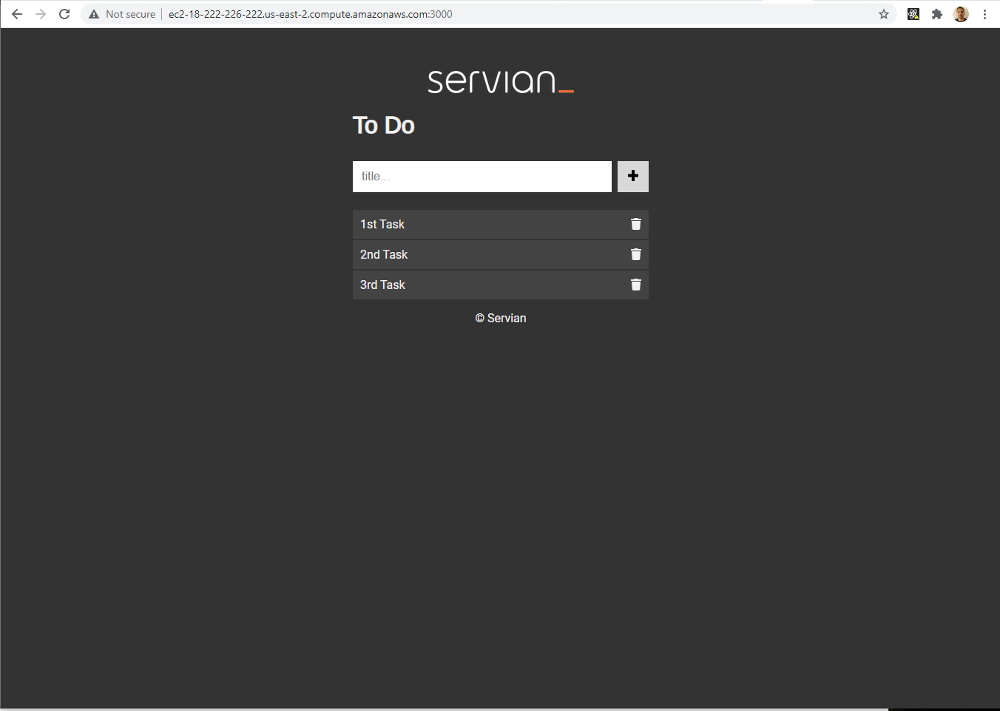
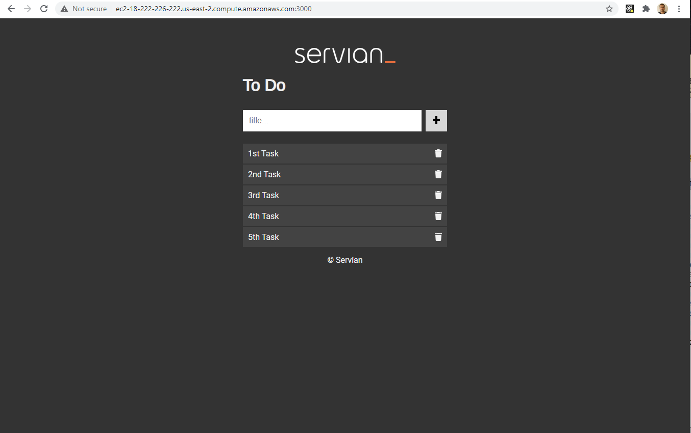
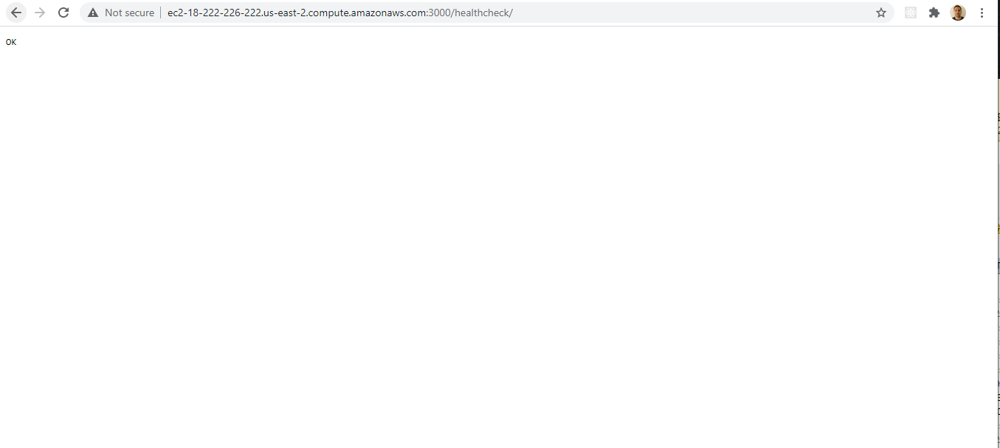
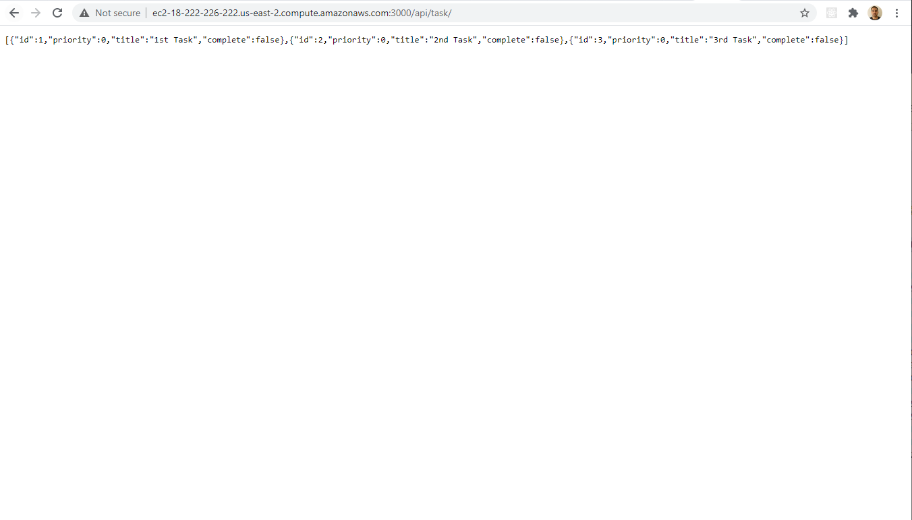
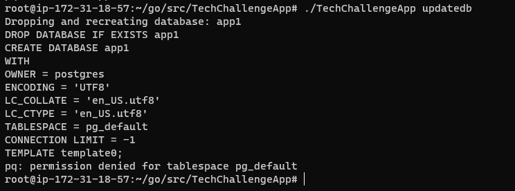
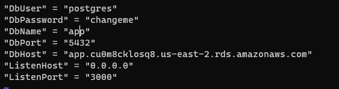
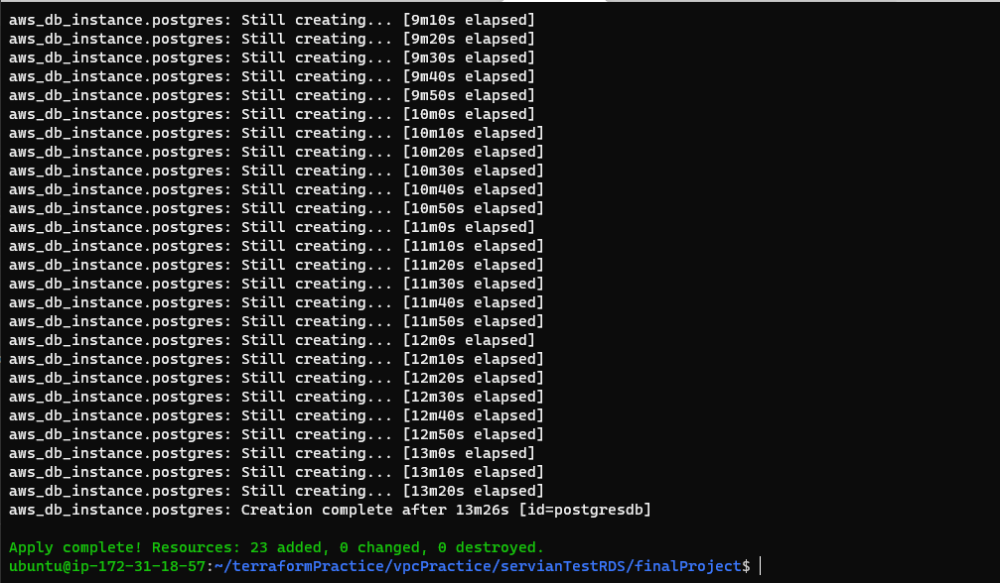
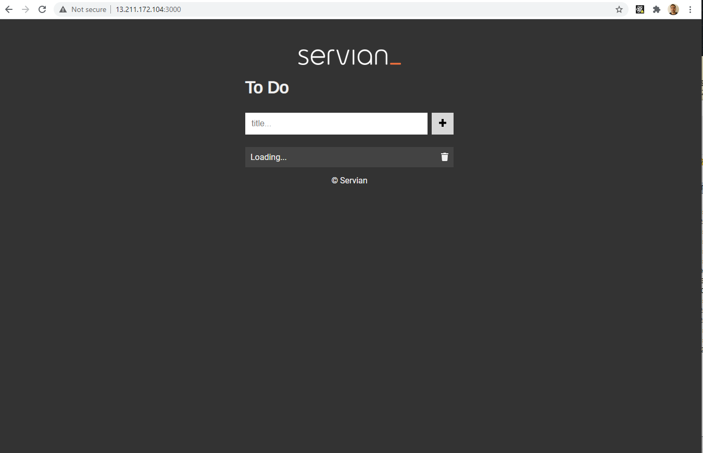

# SUMMARY

I am using Terraform to deploy WebApp and DB to AWS.

- This solution can be run from machine with terraform installed.
- Terraform makes the state of infrastructure easily manageable.
- Deploying the Web Application on EC2 instances.
- Deploying the Database on RDS Postgres.
- Terraform: IAC to provision and manage cloud and services.

# Files Changed and added

- conf.toml
  - Updated ListenHost value to 0.0.0.0
- Introduced Terraform
  - Defined IAM roles and policies for user to be able to implement terraform template
  - Created Load Balancer and implemented Autoscaling groups for frontend to implement AutoScaling and Highly Available Frontend.
  - Implemented MultiAZ RDS instance for Highly available database.

# Running Solution

Update following values in Terraform/terraform.tfvars

```shell script
AWS_ACCESS_KEY = ""
AWS_SECRET_KEY = ""
AWS_REGION = "ap-southeast-2"
```

Change image_id to appropriate ami_id in Line 21 (autoscaling.tf) if using region other than ap-southeast-2

Install Terraform on machine to run the Terraform template

Below Terraform commands were used to initialize the config, plan and apply changes

```shell script
terraform init
terraform plan
terraform apply
```

# Limitations

- Configurations can be applied to config files(.env) instead of hard coding
- Use of Configuration management tool or script to update DBHost after deployment.
- I've used RDS credentials in variable for ease of test. To overcome this limitation I'd use SSM Parameter store to save credentials first and fetch in terraform.

# Challenges and Screenshots

Application is running perfectly when postgres implemented locally with server. But, application cannot connect to database when postgres implemented through RDS.
Tried following versions of RDS Postgres in AWS :-

- PostgreSQL 9.6.20
- PostgreSQL 9.6.21
- PostgreSQL 10.15
- PostgreSQL 10.16
- PostgreSQL 12.5

**Application Default UI when DB hosted Locally with Applcation Server**


**Application UI with updated tasks when DB hosted Locally with Applcation Server**


**Application UI Successful HealthCheck when DB hosted Locally with Applcation Server**


**Application endpoint /api/task Successful HealthCheck when DB hosted Locally with Applcation Server**


**DB Console Error when using RDS**


**DB Config File when using RDS**


**Successful Terraform Apply Screenshot**


**Successful Terraform Apply Application Frontend**

